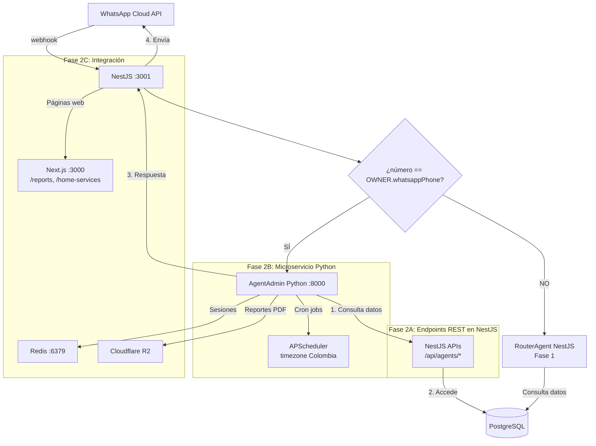

# Architecture — Fase 2: Sistema Multiagente con 3 Fases de Implementación

---

## Visión General Actualizada

La Fase 2 se implementa en **3 fases secuenciales** para garantizar que el sistema Python pueda consumir endpoints REST existentes en NestJS:

1. **Fase 2A**: Endpoints REST en NestJS con autenticación service-to-service
2. **Fase 2B**: Microservicio Python (`apps/agents/`) con LangGraph que consume esos endpoints
3. **Fase 2C**: Integración completa con WhatsApp routing y cron jobs coordinados

**Principio central:** El microservicio Python interactúa exclusivamente con NestJS a través de endpoints REST protegidos con JWT de servicio. NestJS mantiene el control total sobre la base de datos.

---

## Diagrama de Arquitectura Actualizado

### Arquitectura Completa (3 Fases Integradas)



### Flujo de Comunicación Correcto

```
Python Microservicio (:8000)
        │
        ├── JWT de servicio (claim type: "service", firmado con JWT_SECRET)
        │
        ▼
NestJS Endpoints (:3001)
        ├── /api/agents/tenants (listar tenants activos)
        ├── /api/agents/dashboard/summary (datos de ventas)
        ├── /api/agents/inventory/status (stock crítico)
        ├── /api/agents/purchase-orders/draft (crear borrador)
        ├── /api/agents/notifications/stock-alert (alertas)
        └── /api/agents/reports/generate (generar reportes)
        │
        ▼
PostgreSQL Database (Neon)
```

**CORRECTO:** Python → NestJS APIs → PostgreSQL
**INCORRECTO:** Python → PostgreSQL (NO permitido)

---

## Stack Tecnológico por Fase

### Fase 2A: NestJS Endpoints

| Componente    | Tecnología       | Cambios vs Fase 1                                                                              |
| ------------- | ---------------- | ---------------------------------------------------------------------------------------------- |
| Autenticación | JWT extendido    | Nuevo claim `type: "service"` (sin roles falsos; `roleId` sigue siendo el UUID real de `Role`) |
| Guards        | ServiceAuthGuard | Protege endpoints `/api/agents/*`                                                              |
| Controladores | AgentsController | Endpoints REST específicos para agentes                                                        |
| Base de datos | Prisma           | Nuevas tablas: `reports`, `home_service_requests`, `purchase_order_drafts`                     |
| Migraciones   | Prisma Migrate   | Backward compatible con Fase 1                                                                 |

### Fase 2B: Python Microservicio

| Componente        | Tecnología        | Justificación                                          |
| ----------------- | ----------------- | ------------------------------------------------------ |
| Framework agente  | LangGraph 0.2+    | Grafos de estado, production-ready en Python           |
| LLM orchestration | LangChain         | Conectores LLM estandarizados                          |
| LLM primario      | DeepSeek          | Mismo que Fase 1, consistencia                         |
| LLM secundario    | Groq              | Mismo fallback que Fase 1                              |
| API microservicio | FastAPI           | Async nativo, pydantic, compatible con NestJS patterns |
| HTTP client       | httpx             | Async HTTP para llamadas a NestJS                      |
| Validación        | pydantic v2       | Equivalente a Zod en Python                            |
| Análisis datos    | pandas            | Cálculo de tendencias y métricas para reportes         |
| PDF reportes      | reportlab         | Generación de PDFs en Python                           |
| Scheduler         | APScheduler       | Cron jobs con timezone Colombia                        |
| Memoria           | Redis (existente) | TTL 2h para sesiones admin, mismo Redis de Fase 1      |
| Observabilidad    | Sentry Python SDK | Mismo Sentry que Fase 1                                |

### Fase 2C: Integración

| Componente           | Tecnología         | Integración con                                                                                    |
| -------------------- | ------------------ | -------------------------------------------------------------------------------------------------- |
| WhatsApp routing     | NestJS modificado  | `messaging/process-incoming-message.use-case.ts` +15 líneas (verificado: messaging/, no workshop/) |
| Cron jobs            | APScheduler        | Coordinados con endpoints `/api/agents/tenants`                                                    |
| Plataforma web       | Next.js            | Páginas nuevas: `/reports`, `/home-services`                                                       |
| Variables de entorno | .env.local         | Nueva: `AGENTS_BASE_URL`, `ADMIN_SESSION_TTL_SECONDS`, `TZ`                                        |
| Docker Compose       | docker-compose.yml | Nuevo servicio `agents` en puerto 8000                                                             |

---

## Arquitectura de Autenticación Service-to-Service

### JWT Payload Extendido

```typescript
// application/ports/jwt.port.ts
export interface JWTPayload {
  sub: string; // User ID o "agents-service"
  tenantId: string;
  branchId: string | null;
  roleId: string; // Role ID real (UUID de la tabla Role); "" en tokens de servicio
  type?: 'user' | 'service'; // ausente/"user" = usuario; "service" = microservicio Python ← NUEVO
  iat?: number;
  exp?: number;
}
```

### ServiceAuthGuard

```typescript
// presentation/http/guards/service-auth.guard.ts
@Injectable()
export class ServiceAuthGuard implements CanActivate {
  canActivate(context: ExecutionContext): boolean {
    const request = context.switchToHttp().getRequest<Request>();
    const authHeader = request.headers['authorization'];

    if (!authHeader?.startsWith('Bearer ')) {
      throw new UnauthorizedException('Missing Authorization header');
    }

    const token = authHeader.substring(7);
    try {
      const payload = this.jwtService.verify(token);

      // Validar que sea un token de servicio (claim type === 'service').
      // NO se valida contra la tabla Role ni PermissionGuard: es un principal sintético.
      if (payload.type !== 'service') {
        throw new UnauthorizedException('Invalid service token');
      }

      request.service = payload; // NUEVO: servicio autenticado
      return true;
    } catch {
      throw new UnauthorizedException('Invalid or expired service token');
    }
  }
}
```

### Token Generation en Python

```python
# src/agents/shared/auth.py
import jwt
from datetime import datetime, timedelta

def create_service_token(secret: str) -> str:
    """Genera JWT de servicio para NestJS (reusa JWT_SECRET). El tenantId NO va
    en el token: se pasa explícito en cada request."""
    payload = {
        "sub": "agents-service",
        "type": "service",                                # claim que reconoce ServiceAuthGuard
        "iat": datetime.utcnow(),
        "exp": datetime.utcnow() + timedelta(minutes=5),  # corta expiración
    }
    return jwt.encode(payload, secret, algorithm="HS256")
```

---

## Endpoints REST Críticos (Fase 2A)

### Endpoints Internos (Service-to-Service)

> Todos protegidos por **`ServiceAuthGuard`** (claim `type:"service"`). El `tenantId` va explícito en query/body.

| Endpoint                                | Método | Descripción                    | Uso por Python                                                                          |
| --------------------------------------- | ------ | ------------------------------ | --------------------------------------------------------------------------------------- |
| `/api/agents/tenants`                   | GET    | Lista tenants activos          | Cron jobs                                                                               |
| `/api/agents/dashboard/summary`         | GET    | Resumen de ventas por período  | Preguntas del admin / reportes                                                          |
| `/api/agents/inventory/status`          | GET    | Stock crítico y rotación       | Alertas y análisis                                                                      |
| `/api/agents/work-orders/pending`       | GET    | Órdenes activas/demoradas      | Preguntas del admin                                                                     |
| `/api/agents/purchase-orders/draft`     | POST   | Crear borrador orden de compra | Sugerencias de compra                                                                   |
| `/api/agents/reports`                   | POST   | Registrar reporte generado     | Tras subir PDF a R2                                                                     |
| `/api/agents/reports/generate`          | POST   | Disparar generación de reporte | Reportes bajo demanda                                                                   |
| `/api/agents/notifications/stock-alert` | POST   | Notificación in-app de stock   | Alertas automáticas                                                                     |
| `/api/agents/notifications/whatsapp`    | POST   | WhatsApp proactivo al OWNER    | Reportes/alertas (reemplaza `/api/messages/send`, que exige sessionId + JWT de usuario) |

### Endpoints Públicos (Web)

| Endpoint                    | Método | Auth        | Descripción                             |
| --------------------------- | ------ | ----------- | --------------------------------------- |
| `/api/home-services`        | POST   | User JWT    | Crear solicitud de servicio a domicilio |
| `/api/home-services`        | GET    | User JWT    | Listar solicitudes con filtros          |
| `/api/reports`              | GET    | Owner/Admin | Listar reportes generados               |
| `/api/reports/:id/download` | GET    | Owner/Admin | Descargar PDF del reporte               |

---

## Sistema de Cron Jobs Coordinados

### Arquitectura de Cron Jobs

```
APScheduler (Python :8000)
        │ timezone America/Bogota
        │
        ├── Cada lunes 8:00 AM
        │   ├── GET /api/agents/tenants → lista tenants
        │   ├── Para cada tenant:
        │   │   ├── Generar reporte semanal
        │   │   ├── Subir PDF a R2
        │   │   ├── Registrar en BD (reports table)
        │   │   └── Notificar via WhatsApp
        │   └── Log resultados
        │
        ├── Día 1 del mes 8:00 AM
        │   └── Similar a semanal + gráficos mensuales
        │
        └── Cada hora
            ├── GET /api/agents/tenants
            ├── Para cada tenant:
            │   ├── Verificar stock crítico
            │   ├── Redis throttle (24h por repuesto)
            │   └── Enviar alerta si necesario
            └── Log resultados
```

### Coordinación Clave

1. **Lista de tenants**: Python obtiene lista activa via `GET /api/agents/tenants` (token de servicio `type:"service"`)
2. **Throttle con Redis**: Key `alert:stock:{tenant_id}:{part_id}` TTL 24h evita spam
3. **Timezones**: Todos los jobs usan `America/Bogota` (UTC-5)
4. **Fallback**: Si un tenant falla, continúa con los demás

---

## Secuencia de Implementación

### Fase 2A: Endpoints REST en NestJS (Semana 1-2)

**Dependencia crítica**: DEBE completarse antes de Fase 2B

1. **Sprint 1: Autenticación Service-to-Service**

   - Extender JWTPayload con tipo "service"
   - Crear ServiceAuthGuard
   - Crear AgentsController base
   - Implementar endpoint `/api/agents/tenants`

2. **Sprint 2: Endpoints de Datos**

   - `/api/agents/dashboard/summary`
   - `/api/agents/inventory/status`
   - `/api/agents/purchase-orders/draft`
   - Migraciones Prisma: tablas nuevas

3. **Sprint 3: Tool de Servicio a Domicilio**
   - `createHomeServiceRequest` tool
   - HomeServicesController
   - Notificaciones automáticas

### Fase 2B: Microservicio Python (Semana 3-4)

**Dependencia**: Requiere endpoints de Fase 2A funcionando

1. **Sprint 4: Infraestructura Python**

   - Estructura `apps/agents/`
   - Docker Compose integration
   - Cliente HTTP `saas_client.py`

2. **Sprint 5: AgentAdmin Core**

   - LangGraph grafo
   - Nodos: classify, execute_tool, respond, fallback
   - Tools que consumen endpoints NestJS

3. **Sprint 6: Reportes y Alertas**
   - Generación de PDFs
   - Scheduler APScheduler
   - Alertas con throttle Redis

### Fase 2C: Integración Completa (Semana 5)

**Dependencia**: Requiere Fase 2A y 2B completas

1. **Sprint 7: WhatsApp Routing**

   - Modificación en `application/use-cases/messaging/process-incoming-message.use-case.ts` (verificado: messaging/, no workshop/)
   - Endpoint `POST /agents/admin` en Python
   - Fallback a recepcionista humano

2. **Sprint 8: Plataforma Web**

   - Página `/reports`
   - Página `/home-services`
   - Página `/purchase-orders`

3. **Sprint 9: Deploy y Testing**
   - Variables de entorno producción
   - CI/CD GitHub Actions para Python
   - Tests de integración end-to-end

---

## Estructura de Directorios Actualizada

```
apps/agents/                           # Fase 2B
├── pyproject.toml                    # Dependencias Python 3.12+
├── Dockerfile                        # Python slim
├── .env.example                      # Variables específicas Python
├── src/
│   ├── main.py                       # FastAPI app entry point
│   ├── config.py                     # pydantic-settings
│   │
│   ├── agents/
│   │   ├── admin/                    # AgentAdmin LangGraph
│   │   │   ├── agent.py              # Grafo StateGraph
│   │   │   ├── state.py              # AdminAgentState TypedDict
│   │   │   ├── nodes.py              # classify, execute_tool, respond, fallback
│   │   │   └── prompts.py            # System prompts español colombiano
│   │   └── shared/
│   │       ├── llm_factory.py        # DeepSeek → Groq fallback
│   │       ├── memory.py             # Redis session management TTL 2h
│   │       └── auth.py               # Generar JWT para NestJS
│   │
│   ├── tools/                        # Tools que consumen endpoints NestJS
│   │   ├── inventory_tools.py        # get_inventory_status
│   │   ├── sales_tools.py            # get_sales_summary
│   │   ├── order_tools.py            # prepare_purchase_order
│   │   ├── report_tools.py           # trigger_report_generation
│   │   ├── notification_tools.py     # send_stock_alert
│   │   └── tenant_tools.py           # get_active_tenants (para cron jobs)
│   │
│   ├── schedulers/                   # Cron jobs coordinados
│   │   ├── scheduler.py              # APScheduler + timezone Colombia
│   │   ├── weekly_report.py          # lunes 8am
│   │   ├── monthly_report.py         # día 1 del mes 8am
│   │   └── stock_alert.py            # cada hora, throttle 24h
│   │
│   ├── reports/                      # Generación de reportes
│   │   ├── generator.py              # Orquestador
│   │   ├── templates/
│   │   │   ├── weekly.py             # Template semanal
│   │   │   └── monthly.py            # Template mensual con gráficos
│   │   └── uploader.py               # Sube PDF a R2
│   │
│   ├── api/                          # FastAPI endpoints
│   │   ├── router.py                 # FastAPI routers
│   │   ├── admin_handler.py          # POST /agents/admin
│   │   └── health.py                 # GET /health
│   │
│   └── clients/
│       └── saas_client.py            # httpx async client → NestJS con JWT
```

---

## Variables de Entorno Nuevas

### `.env.local` - Agregar

```bash
# Fase 2 — Autenticación Service-to-Service
# El microservicio Python firma los tokens de servicio con el JWT_SECRET ya existente.
# (No se crea un secreto nuevo; el claim type:"service" los distingue del JWT de usuario.)

# Fase 2 — Microservicio Agentes
AGENTS_BASE_URL="http://localhost:8000"    # dev local
API_BASE_URL="http://localhost:3001"       # NestJS dev
ADMIN_SESSION_TTL_SECONDS=7200             # 2 horas
TZ="America/Bogota"                        # Timezone para cron jobs

# Fase 2 — LLM Providers
DEEPSEEK_API_KEY=                          # Mismo que Fase 1
GROQ_API_KEY=                              # Mismo que Fase 1

# Fase 2 — Reportes
R2_REPORTS_BUCKET=${R2_BUCKET_NAME}        # Mismo bucket que Fase 1
R2_REPORTS_FOLDER="reports"                # Subfolder específico
```

---

## Docker Compose Actualizado

```yaml
# Agregar al docker-compose.yml existente
services:
  agents:
    build:
      context: ./apps/agents
      dockerfile: Dockerfile
    ports:
      - '8000:8000'
    environment:
      REDIS_URL: redis://redis:6379 # dentro de la red Docker (NO ${REDIS_URL}, que es localhost)
      API_BASE_URL: http://api:3001 # red Docker interna (requiere el servicio `api` containerizado)
      JWT_SECRET: ${JWT_SECRET} # el microservicio firma tokens de servicio con él
      DEEPSEEK_API_KEY: ${DEEPSEEK_API_KEY}
      GROQ_API_KEY: ${GROQ_API_KEY}
      R2_ACCOUNT_ID: ${R2_ACCOUNT_ID}
      R2_ACCESS_KEY_ID: ${R2_ACCESS_KEY_ID}
      R2_SECRET_ACCESS_KEY: ${R2_SECRET_ACCESS_KEY}
      R2_BUCKET_NAME: ${R2_BUCKET_NAME}
      SENTRY_DSN: ${SENTRY_DSN}
      TZ: America/Bogota # Timezone para cron jobs
      ADMIN_SESSION_TTL_SECONDS: 7200
    depends_on:
      - redis
      - api # Espera a NestJS
    networks:
      - motoworkshop-net

networks:
  motoworkshop-net:
    driver: bridge
```

---

## Decisiones Arquitectónicas Clave

### ADR-F2-001: Los agentes no acceden directamente a la BD

**Razón**: Mantiene la separación de responsabilidades. NestJS es la única capa que conoce el modelo de datos. Si cambia el schema, solo cambia NestJS, no Python.

### ADR-F2-002: Autenticación Service-to-Service con JWT

**Razón**: Simple, reutiliza infraestructura existente (JWT_SECRET), sin necesidad de API keys separadas. Tokens de corta expiración (5 min) mejoran seguridad.

### ADR-F2-003: Redis compartido entre servicios

**Razón**: El mismo Redis de Fase 1 sirve para memoria de sesión y throttle. Keys con prefijos distintos evitan colisiones.

### ADR-F2-004: Cron jobs coordinados vía API

**Razón**: Python obtiene lista de tenants via API, no leyendo BD directamente. Permite escalar y manejar fallos por tenant individualmente.

### ADR-F2-005: Timezone Colombia para todos los jobs

**Razón**: Los dueños de talleres trabajan en horario Colombia. Reportes a las 8am hora local son útiles, no a las 8am UTC.

---

## Criterios de Éxito por Fase

### Fase 2A Completada:

- ✅ ServiceAuthGuard protege endpoints `/api/agents/*`
- ✅ Python puede autenticarse con tokens de servicio (claim `type: "service"`)
- ✅ Endpoints retornan datos reales de BD
- ✅ Migraciones aplicadas: `reports`, `home_service_requests`, `purchase_order_drafts`

### Fase 2B Completada:

- ✅ `docker-compose up` levanta Python en puerto 8000
- ✅ AgentAdmin responde preguntas usando endpoints NestJS
- ✅ Reportes se generan manualmente y suben a R2
- ✅ Alertas de stock funcionan con throttle Redis 24h

### Fase 2C Completada:

- ✅ Admin escribe por WhatsApp → respuesta en ≤ 15s (ruteo correcto)
- ✅ Cliente solicita domicilio → notificación al taller en ≤ 30s
- ✅ Reportes semanales se generan automáticamente cada lunes 8am Colombia
- ✅ Plataforma web muestra reportes y solicitudes de domicilio

---

## Consideraciones de Performance

### Límites y Timeouts

- **Tool calls**: Máximo 5 por mensaje del admin
- **Timeout por tool**: 10 segundos
- **Timeout total agente**: 30 segundos
- **Sesión Redis TTL**: 2 horas de inactividad
- **Tokens de servicio**: 5 minutos expiración

### Escalabilidad

- **Python microservicio**: Stateless, puede escalar horizontalmente
- **Redis**: Compartido, ya escala con Fase 1
- **Cron jobs**: Procesan tenants secuencialmente, no paralelo (evita sobrecarga BD)
- **Throttle**: 24 horas por repuesto evita spam en altos volúmenes

### Monitorización

- **Sentry**: Errores de Python y NestJS en mismo proyecto
- **Logs estructurados**: JSON para parsing en ELK/CloudWatch
- **Health checks**: `/health` en Python verifica Redis y conexión a NestJS
- **Metrics**: Duraciones de tools, éxito/fallo de cron jobs

---

## Resumen de Cambios vs Arquitectura Anterior

| Aspecto               | Versión Anterior    | Versión Actualizada                                                     | Razón                        |
| --------------------- | ------------------- | ----------------------------------------------------------------------- | ---------------------------- |
| **Fases**             | 1 fase única        | 3 fases secuenciales (2A, 2B, 2C)                                       | Dependencias claras          |
| **Autenticación**     | No especificada     | Service-to-Service JWT (claim `type:"service"`, firmado con JWT_SECRET) | Seguridad y separación       |
| **Comunicación**      | Python → BD directo | Python → NestJS APIs → BD                                               | Separación responsabilidades |
| **Cron jobs**         | No coordinados      | Coordinados via `/api/agents/tenants`                                   | Escalabilidad y fallos       |
| **Variables entorno** | Básicas             | Completas con timezone y TTLs                                           | Configuración robusta        |
| **Secuencia**         | No especificada     | Secuencia obligatoria 2A→2B→2C                                          | Planificación realista       |

---

**Estado actual**: Arquitectura actualizada y consistente con diseño y tareas. Lista para implementación siguiendo la secuencia 2A → 2B → 2C.
