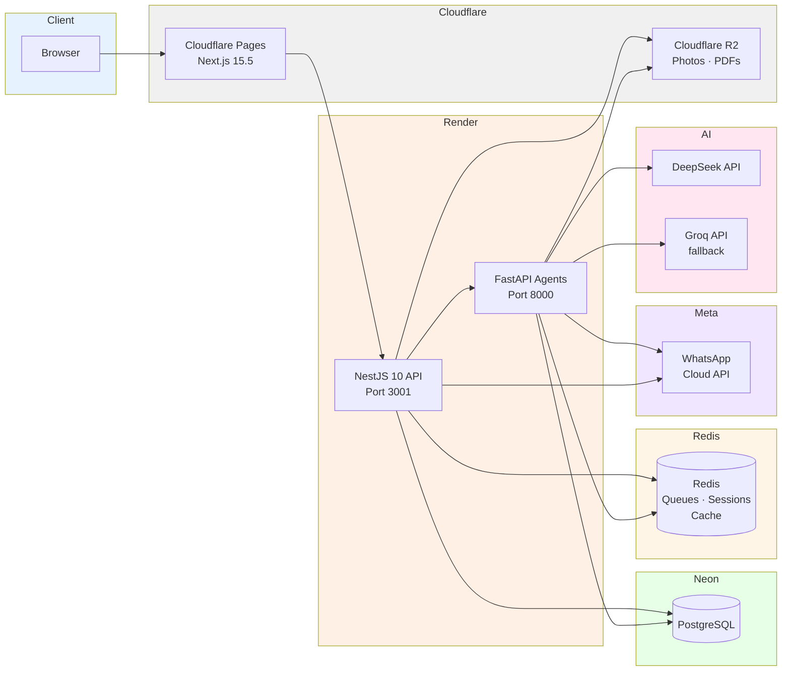

# Architecture

**🌐 English** · [Español](./ARCHITECTURE.md)

## System Diagram



---

## NestJS API — Hexagonal Architecture

```
┌─────────────────────────────────────────────────────┐
│                   Presentation                       │
│  controllers/ · guards/ · filters/ · interceptors/   │
│  Validates input, serializes output, HTTP concerns   │
├─────────────────────────────────────────────────────┤
│                   Infrastructure                     │
│  auth/ · crypto/ · messaging/ · notifications/       │
│  persistence/ · storage/ · ai/ · agents/             │
│  Concrete implementations (Prisma, JWT, R2, etc.)    │
├─────────────────────────────────────────────────────┤
│                   Application                        │
│  use-cases/ · ports/ · services/                     │
│  Use cases, business logic, ports (interfaces)       │
├─────────────────────────────────────────────────────┤
│                   Domain                             │
│  entities/ · repositories/ · value-objects/          │
│  Business core, no external dependencies             │
└─────────────────────────────────────────────────────┘
```

### Principles

1. **Domain** imports nothing from upper layers. Pure TypeScript + shared types only.
2. **Application** defines **ports** (interfaces) in `ports/` that Infrastructure implements.
3. **Infrastructure** depends on Application (implements ports), not the other way around (DIP).
4. **Presentation** only orchestrates: receives a request, calls a use case, returns a response.

### Dependency Inversion with Symbol Tokens

NestJS cannot inject TypeScript interfaces because the compiler erases them at runtime. To keep real DIP (without coupling the use case to the concrete implementation), this pattern is used:

```typescript
// ports/whatsapp-sender.port.ts
export const WHATSAPP_SENDER_PORT = Symbol('WHATSAPP_SENDER_PORT');

export interface WhatsAppSenderPort {
  sendToPhone(to: string, message: string, sentBy: string | null): Promise<void>;
}
```

```typescript
// infrastructure/messaging/whatsapp-cloud.adapter.ts
@Injectable()
export class WhatsAppCloudAdapter implements WhatsAppSenderPort { ... }
```

```typescript
// messaging.module.ts
providers: [{ provide: WHATSAPP_SENDER_PORT, useClass: WhatsAppCloudAdapter }];
```

```typescript
// use case (knows only the port, never the implementation)
constructor(
  @Inject(WHATSAPP_SENDER_PORT)
  private readonly whatsapp: WhatsAppSenderPort,
) {}
```

**Trade-off**: more boilerplate (explicit registration in the module) in exchange for being able to swap the WhatsApp implementation without touching the use case.

---

## NestJS Modules

| Module                | Port                                       | Responsibility                                                                                                   |
| --------------------- | ------------------------------------------ | ---------------------------------------------------------------------------------------------------------------- |
| `IdentityModule`      | —                                          | Authentication, JWT, roles, permissions                                                                          |
| `CustomersModule`     | `CUSTOMERS_MODULE`                         | Customer CRUD + WhatsApp session                                                                                 |
| `VehiclesModule`      | —                                          | Vehicle CRUD + history                                                                                           |
| `WorkshopModule`      | —                                          | Work orders, statuses, parts                                                                                     |
| `InventoryModule`     | —                                          | Parts, per-branch stock                                                                                          |
| `CommerceModule`      | —                                          | Motorcycle sales, sale orders                                                                                    |
| `MessagingModule`     | `WHATSAPP_SENDER_PORT`                     | WhatsApp Cloud API (sending + webhook)                                                                           |
| `AiModule`            | `ROUTER_AGENT_PORT`, `AGENTS_SERVICE_PORT` | RouterAgent LLM + tool execution                                                                                 |
| `AgentsModule`        | —                                          | Service-to-service with Python                                                                                   |
| `NotificationsModule` | —                                          | In-app notifications (REST API + WebSocket gateway; the web client currently consumes REST on a timer — ADR-012) |
| `DashboardModule`     | —                                          | Summaries and metrics                                                                                            |
| `SettingsModule`      | —                                          | Tenant configuration                                                                                             |
| `SalesModule`         | —                                          | Sales module (catalog + units)                                                                                   |
| `HomeServicesModule`  | —                                          | Home services                                                                                                    |
| `AuditModule`         | —                                          | Action auditing                                                                                                  |
| `ReferenceModule`     | —                                          | Reference tables (models, etc.)                                                                                  |

---

## Multi-Agent System (Phase 2)

### RouterAgent (NestJS — WhatsApp conversation)

```
WhatsApp Message
      │
      ▼
RouterAgent.process(text, phone)
      │
      ├── classify_intent (LLM)
      │   ├── tool_call → ToolExecutor.execute()
      │   │   ├── Success → respond
      │   │   └── Failure → retry (max 3)
      │   │       └── No output → escalate_to_human
      │   └── respond (generates answer)
      │
      ▼
  Sends the reply to WhatsApp
```

- Uses DeepSeek as the primary LLM, Groq as fallback.
- Tool system: sample, inventory query, order lookup, etc.
- Escalates to a human if it detects keywords or fails after 5 attempts.

### AgentAdmin (Python FastAPI + LangGraph — management dashboard)

```
POST /agents/admin { message, phoneNumber, tenantId }
      │
      ▼
  AdminHandler.handle()
      │
      ▼
  RedisSessionStore.get_or_create()
      │
      ▼
  AdminAgent.run(state)
      │
      ├── classify_intent (LangGraph node)
      │   ├── SALES_QUERY
      │   ├── INVENTORY_QUERY
      │   ├── REPORT_REQUEST
      │   ├── PURCHASE_ORDER_REQUEST  → lists low-stock parts, asks to "confirm"
      │   ├── PURCHASE_ORDER_CONFIRM  → creates purchase-order draft (DRAFT)
      │   └── GENERAL
      │
      ├── execute_tool (node)
      │   └── Via admin_tools.py → httpx → NestJS API
      │
      └── respond (node)
```

**Purchase-order confirmation (anti false-positive).** `PURCHASE_ORDER_CONFIRM`
is triggered by short affirmations ("yes", "go ahead", "confirm") that the LLM can
mistake for a confirmation even when no order was proposed. To avoid creating
spurious drafts, the agent keeps an `awaiting_po_confirmation` flag in the Redis
session: it is `True` only on the turn immediately after a
`PURCHASE_ORDER_REQUEST`. If a `PURCHASE_ORDER_CONFIRM` arrives without that flag
active, it degrades to `GENERAL` (natural reply, creating nothing). The flag is
cleared after the confirmation or on any other intent. Note: the created draft is
`status: 'DRAFT'` and **requires explicit human approval** in the platform before
having any effect — it neither contacts suppliers nor reserves stock automatically.

### Schedulers (Python APScheduler)

| Job              | Schedule        | Action                                         |
| ---------------- | --------------- | ---------------------------------------------- |
| `stock_alert`    | Hourly          | Checks low stock, sends WhatsApp to the owner  |
| `weekly_report`  | Mon 8am Bogotá  | Generates weekly PDF, uploads to R2, notifies  |
| `monthly_report` | 1st, 8am Bogotá | Generates monthly PDF, uploads to R2, notifies |

The schedulers iterate over all active tenants via `SaasClient.list_active_tenants()`.

---

## Service-to-Service Authentication

NestJS ↔ Python communication uses a JWT with `service` type:

```typescript
// TokenFactoryService (NestJS)
sign({ sub: 'agents-service', type: 'service' }, { expiresIn: '5m' });
```

```python
# saas_client.py (Python)
headers = {"Authorization": f"Bearer {self.token}"}
# The token is refreshed automatically on expiry
```

- The token has a short TTL (5 min, configurable via `SERVICE_TOKEN_TTL_SECONDS`).
- Python renews it automatically before it expires.
- `ServiceAuthGuard` in NestJS verifies that `token.type === "service"`.

---

## Database

- **ORM**: Prisma 5 with PostgreSQL.
- **Schema**: `apps/api/prisma/schema.prisma` (872 lines, 37 models).
- **Conventions**: UUIDs as PK, snake_case table names, timestamptz, soft-delete on the main entities (customers, vehicles, orders).
- **Migrations**: `prisma migrate deploy` in production (never `migrate dev`).

Main models:

```
Tenant ──┬── Branch ──┬── WorkOrder ──┬── WorkOrderLine
         │            │               ├── WorkOrderPart
         │            │               ├── Payment
         │            │               └── Quote ── QuoteVersion
         │            ├── PartBranchStock ── StockEntry
         │            └── ServiceCatalogItem
         │
         ├── User ── Role ── RolePermission
         ├── Customer ── Vehicle ── VehicleOwnershipHistory
         ├── WhatsAppSession ── Message
         ├── MotorcycleUnit ── SaleOrder ── SalePayment
         └── Report ── PurchaseOrderDraft
```

---

## Key Design Decisions

| Decision                    | Alternative                    | Trade-off                                                                                                                                                                                                                                                                                                     |
| --------------------------- | ------------------------------ | ------------------------------------------------------------------------------------------------------------------------------------------------------------------------------------------------------------------------------------------------------------------------------------------------------------- |
| Hexagonal + DIP             | Flat per-feature modules       | More boilerplate, but better testability and replaceability                                                                                                                                                                                                                                                   |
| Symbol-token DI             | Injection by concrete class    | More manual registration, but runtime-safe (TS erases interfaces)                                                                                                                                                                                                                                             |
| Python for AI agents        | LangChain.JS / Vercel AI SDK   | More mature Python ecosystem for LLM tooling; more complex polyglot stack                                                                                                                                                                                                                                     |
| Cloudflare Pages + Render   | Vercel + Railway               | More generous free tier (CF edge, Render Dockerfile); ~50s cold starts on Render free                                                                                                                                                                                                                         |
| App-level AES-256-GCM       | Neon at-rest encryption only   | Cannot run WHERE over encrypted fields; extra protection against a DB leak                                                                                                                                                                                                                                    |
| BullMQ + Redis              | Direct synchronous queue       | Resilience against WhatsApp/API failures; more infrastructure                                                                                                                                                                                                                                                 |
| WhatsApp Cloud API directly | BSP (Twilio, 360dialog, Kapso) | No per-message markup or extra vendor; the coupling to Meta is isolated in 2 files (`meta-whatsapp.client.ts` + webhook controller) thanks to the ports — switching provider is rewriting ~170 lines. Re-evaluate a BSP with embedded signup only if Phase 3 onboards multiple tenants with their own numbers |

**WhatsApp's 24h window (outbound messages).** Meta only allows free-form text
within 24h of the customer's last message; outside that window it requires
approved templates (error 131047). Because the app's own message log knows the
window state, the decision is made **before enqueueing** (`whatsapp-cloud.adapter.ts`,
with a 30-min margin for retries): open window → free text; closed → utility
template (`WHATSAPP_UTILITY_TEMPLATE`, one parameter with the message). Meta 4xx
errors are not retried (`UnrecoverableError` stops BullMQ retries) and every
definitive failure marks the message `FAILED` **and** notifies admins
(`WHATSAPP_SEND_FAILED`) — it used to fail silently in the DB.

See [ADR.en.md](ADR.en.md) for the detailed record of each decision.
