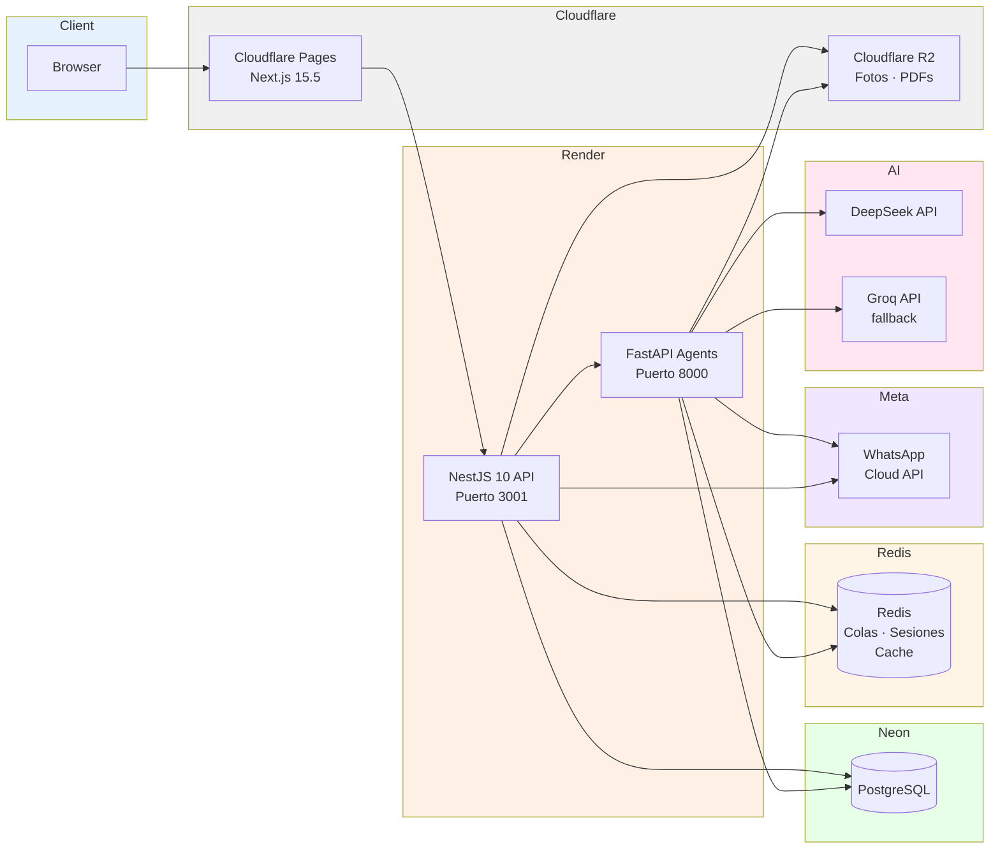

# Architecture

[English](./ARCHITECTURE.en.md) · **🌐 Español**

## System Diagram



---

## NestJS API — Arquitectura Hexagonal

```
┌─────────────────────────────────────────────────────┐
│                   Presentation                       │
│  controllers/ · guards/ · filters/ · interceptors/   │
│  Valida input, serializa output, HTTP concerns       │
├─────────────────────────────────────────────────────┤
│                   Infrastructure                     │
│  auth/ · crypto/ · messaging/ · notifications/       │
│  persistence/ · storage/ · ai/ · agents/             │
│  Implementaciones concretas (Prisma, JWT, R2, etc.)  │
├─────────────────────────────────────────────────────┤
│                   Application                        │
│  use-cases/ · ports/ · services/                     │
│  Casos de uso, lógica de negocio, puertos (interfaces)│
├─────────────────────────────────────────────────────┤
│                   Domain                             │
│  entities/ · repositories/ · value-objects/          │
│  Núcleo del negocio, sin dependencias externas       │
└─────────────────────────────────────────────────────┘
```

### Principios

1. **Domain** no importa nada de capas superiores. Solo TypeScript puro + tipos compartidos.
2. **Application** define **puertos** (interfaces) en `ports/` que Infrastructure implementa.
3. **Infrastructure** depende de Application (implementa puertos), no al revés (DIP).
4. **Presentation** solo orquesta: recibe request, llama un use-case, devuelve response.

### Inversión de Dependencias con Symbol Tokens

NestJS no puede inyectar interfaces de TypeScript porque el compilador las borra en runtime. Para mantener DIP real (sin acoplar el use-case a la implementación concreta), se usa este patrón:

```typescript
// ports/whatsapp-sender.port.ts
export const WHATSAPP_SENDER_PORT = Symbol('WHATSAPP_SENDER_PORT');

export interface WhatsAppSenderPort {
  sendToPhone(to: string, message: string, sentBy: string | null): Promise<void>;
}
```

```typescript
// infrastructure/messaging/whatsapp-cloud.adapter.ts
@Injectable()
export class WhatsAppCloudAdapter implements WhatsAppSenderPort { ... }
```

```typescript
// messaging.module.ts
providers: [{ provide: WHATSAPP_SENDER_PORT, useClass: WhatsAppCloudAdapter }];
```

```typescript
// use-case (solo conoce el puerto, nunca la implementación)
constructor(
  @Inject(WHATSAPP_SENDER_PORT)
  private readonly whatsapp: WhatsAppSenderPort,
) {}
```

**Trade-off**: más boilerplate (registro explícito en módulo) a cambio de poder cambiar la implementación de WhatsApp sin tocar el caso de uso.

---

## Módulos NestJS

| Módulo                | Puerto                                     | Responsabilidad                                                                                                     |
| --------------------- | ------------------------------------------ | ------------------------------------------------------------------------------------------------------------------- |
| `IdentityModule`      | —                                          | Autenticación, JWT, roles, permisos                                                                                 |
| `CustomersModule`     | `CUSTOMERS_MODULE`                         | CRUD clientes + WhatsApp session                                                                                    |
| `VehiclesModule`      | —                                          | CRUD vehículos + historial                                                                                          |
| `WorkshopModule`      | —                                          | Órdenes de trabajo, estados, partes                                                                                 |
| `InventoryModule`     | —                                          | Partes, stock por sucursal                                                                                          |
| `CommerceModule`      | —                                          | Ventas de motos, órdenes de venta                                                                                   |
| `MessagingModule`     | `WHATSAPP_SENDER_PORT`                     | WhatsApp Cloud API (envío + webhook)                                                                                |
| `AiModule`            | `ROUTER_AGENT_PORT`, `AGENTS_SERVICE_PORT` | RouterAgent LLM + tool execution                                                                                    |
| `AgentsModule`        | —                                          | Service-to-service con Python                                                                                       |
| `NotificationsModule` | —                                          | Notificaciones in-app (API REST + gateway WebSocket; el cliente web consume hoy el REST por temporizador — ADR-012) |
| `DashboardModule`     | —                                          | Resúmenes y métricas                                                                                                |
| `SettingsModule`      | —                                          | Configuración del tenant                                                                                            |
| `SalesModule`         | —                                          | Módulo de ventas (catálogo + unidades)                                                                              |
| `HomeServicesModule`  | —                                          | Servicios a domicilio                                                                                               |
| `AuditModule`         | —                                          | Auditoría de acciones                                                                                               |
| `ReferenceModule`     | —                                          | Tablas de referencia (modelos, etc.)                                                                                |

---

## Sistema Multi-Agente (Fase 2)

### RouterAgent (NestJS — conversación WhatsApp)

```
WhatsApp Message
      │
      ▼
RouterAgent.process(text, phone)
      │
      ├── classify_intent (LLM)
      │   ├── tool_call → ToolExecutor.execute()
      │   │   ├── Éxito → respond
      │   │   └── Fracaso → retry (max 3)
      │   │       └── Sin salida → escalate_to_human
      │   └── respond (genera respuesta)
      │
      ▼
  Envía respuesta a WhatsApp
```

- Usa DeepSeek como LLM principal, Groq como fallback.
- Sistema de herramientas: sample, inventory query, order lookup, etc.
- Escalado a humano si detecta palabras clave o falla tras 5 intentos.

### AgentAdmin (Python FastAPI + LangGraph — management dashboard)

```
POST /agents/admin { message, phoneNumber, tenantId }
      │
      ▼
  AdminHandler.handle()
      │
      ▼
  RedisSessionStore.get_or_create()
      │
      ▼
  AdminAgent.run(state)
      │
      ├── classify_intent (LangGraph node)
      │   ├── SALES_QUERY
      │   ├── INVENTORY_QUERY
      │   ├── REPORT_REQUEST
      │   ├── PURCHASE_ORDER_REQUEST  → lista repuestos bajos, pide "confirmar"
      │   ├── PURCHASE_ORDER_CONFIRM  → crea borrador de orden de compra (DRAFT)
      │   └── GENERAL
      │
      ├── execute_tool (node)
      │   └── Via admin_tools.py → httpx → NestJS API
      │
      └── respond (node)
```

**Confirmación de orden de compra (anti-falso-positivo).** `PURCHASE_ORDER_CONFIRM`
se dispara con afirmaciones cortas ("sí", "dale", "confirmar") que el LLM puede
confundir con una confirmación aunque no se haya propuesto ninguna orden. Para
evitar crear borradores espurios, el agente mantiene un flag
`awaiting_po_confirmation` en la sesión Redis: solo es `True` en el turno
inmediatamente posterior a un `PURCHASE_ORDER_REQUEST`. Si llega un
`PURCHASE_ORDER_CONFIRM` sin ese flag activo, se degrada a `GENERAL` (respuesta
natural, sin crear nada). El flag se limpia tras la confirmación o ante cualquier
otro intent. Nota: el borrador creado es `status: 'DRAFT'` y **requiere aprobación
humana explícita** en la plataforma antes de tener efecto — no contacta proveedores
ni reserva stock automáticamente.

### Schedulers (Python APScheduler)

| Job              | Schedule         | Acción                                       |
| ---------------- | ---------------- | -------------------------------------------- |
| `stock_alert`    | Cada hora        | Verifica stock bajo, envía WhatsApp al dueño |
| `weekly_report`  | Lunes 8am Bogotá | Genera PDF semanal, sube a R2, notifica      |
| `monthly_report` | Día 1 8am Bogotá | Genera PDF mensual, sube a R2, notifica      |

Los schedulers iteran sobre todos los tenants activos vía `SaasClient.list_active_tenants()`.

---

## Autenticación Service-to-Service

La comunicación NestJS ↔ Python usa JWT con tipo `service`:

```typescript
// TokenFactoryService (NestJS)
sign({ sub: 'agents-service', type: 'service' }, { expiresIn: '5m' });
```

```python
# saas_client.py (Python)
headers = {"Authorization": f"Bearer {self.token}"}
# El token se refresca automáticamente al expirar
```

- El token tiene TTL corto (5 min, configurable vía `SERVICE_TOKEN_TTL_SECONDS`).
- Python renueva automáticamente antes de que expire.
- `ServiceAuthGuard` en NestJS verifica que `token.type === "service"`.

---

## Base de datos

- **ORM**: Prisma 5 con PostgreSQL.
- **Esquema**: `apps/api/prisma/schema.prisma` (872 líneas, 37 modelos).
- **Convenciones**: UUIDs como PK, snake_case en tablas, timestamptz, soft-delete en entidades principales (clientes, vehículos, órdenes).
- **Migraciones**: `prisma migrate deploy` en producción (nunca `migrate dev`).

Modelos principales:

```
Tenant ──┬── Branch ──┬── WorkOrder ──┬── WorkOrderLine
         │            │               ├── WorkOrderPart
         │            │               ├── Payment
         │            │               └── Quote ── QuoteVersion
         │            ├── PartBranchStock ── StockEntry
         │            └── ServiceCatalogItem
         │
         ├── User ── Role ── RolePermission
         ├── Customer ── Vehicle ── VehicleOwnershipHistory
         ├── WhatsAppSession ── Message
         ├── MotorcycleUnit ── SaleOrder ── SalePayment
         └── Report ── PurchaseOrderDraft
```

---

## Decisiones de diseño clave

| Decisión                   | Alternativa                    | Trade-off                                                                                                                                                                                                                                                                                                            |
| -------------------------- | ------------------------------ | -------------------------------------------------------------------------------------------------------------------------------------------------------------------------------------------------------------------------------------------------------------------------------------------------------------------- |
| Hexagonal + DIP            | Módulos planos por feature     | Más boilerplate, pero mejor testabilidad y reemplazabilidad                                                                                                                                                                                                                                                          |
| Symbol tokens DI           | Inyección por clase concreta   | Más registro manual, pero runtime-safe (TS borra interfaces)                                                                                                                                                                                                                                                         |
| Python para agentes IA     | LangChain.JS / Vercel AI SDK   | Ecosistema Python más maduro para LLM tooling; stack políglota más complejo                                                                                                                                                                                                                                          |
| Cloudflare Pages + Render  | Vercel + Railway               | Free tier más generoso (CF edge, Render Dockerfile); cold starts de ~50s en Render free                                                                                                                                                                                                                              |
| AES-256-GCM aplicación     | Solo cifrado Neon en reposo    | No se puede hacer WHERE sobre campos cifrados; protección extra contra fuga de DB                                                                                                                                                                                                                                    |
| BullMQ + Redis             | Cola síncrona directa          | Resiliencia ante fallos de WhatsApp/API; más infraestructura                                                                                                                                                                                                                                                         |
| WhatsApp Cloud API directo | BSP (Twilio, 360dialog, Kapso) | Sin markup por mensaje ni vendor extra; el acoplamiento a Meta queda aislado en 2 archivos (`meta-whatsapp.client.ts` + webhook controller) gracias a los puertos — cambiar de proveedor es reescribir ~170 líneas. Reevaluar BSP con embedded signup solo si Fase 3 onboardea múltiples tenants con números propios |

**Ventana de 24h de WhatsApp (mensajes salientes).** Meta solo permite texto libre
dentro de las 24h posteriores al último mensaje del cliente; fuera de esa ventana
exige plantillas aprobadas (error 131047). Como el log de mensajes propio conoce el
estado de la ventana, la decisión se toma **antes de encolar** (`whatsapp-cloud.adapter.ts`,
con margen de 30 min por los reintentos): ventana abierta → texto libre; cerrada →
plantilla utility (`WHATSAPP_UTILITY_TEMPLATE`, un parámetro con el mensaje). Los errores
4xx de Meta no se reintentan (`UnrecoverableError` corta los reintentos de BullMQ) y todo
fallo definitivo marca el mensaje `FAILED` **y** notifica a los admins (`WHATSAPP_SEND_FAILED`)
— antes quedaba silencioso en la BD.

Ver [ADR.md](ADR.md) para el registro detallado de cada decisión.
